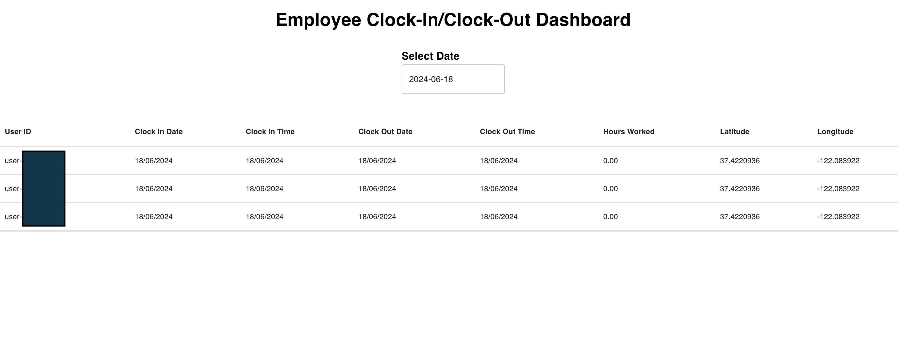

  

# Employee Clock-In Clock-Out Dashboard

  

A modern and professional dashboard application for managing employee clock-in and clock-out times. This application helps businesses track employee attendance efficiently and reliably.

## Screenshots

  



  

## Table of Contents

  

- [Features](#features)

- [Installation](#installation)

- [Usage](#usage)

- [Contributing](#contributing)

- [License](#license)

  

## Features

  

- View employee clock-in and clock-out times.

- Calculate hours worked each day.

- Select and view data for specific dates.

- Minimalist and user-friendly interface.

- Real-time data updates from Firestore.

  

## Installation

  

1. ****Clone the repository:****

  

```

git clone https://github.com/yourusername/employee-clockin-dashboard.git

cd employee-clockin-dashboard

```

  

2. ****Install dependencies:****

  

```

npm install

```

  

3. ****Set up Firebase:****

  

- Create a Firebase project at [Firebase Console](https://console.firebase.google.com/).

- Add firebase.js file in the root of your project:

  

```

import { initializeApp } from  "firebase/app";

import { getFirestore } from  "firebase/firestore";

  

const  firebaseConfig  = {

apiKey:  "your_api_key",

authDomain:  "your_auth_domain",

projectId:  "your_project_id",

storageBucket:  "your_storage_bucket",

messagingSenderId:  "your_messaging_sender_id",

appId:  "your_app_id",

};

  

const  app  =  initializeApp(firebaseConfig);

const  db  =  getFirestore(app, "paulclock");

  

export { db };

```

  

4. ****Run the app:****

  

```

npm start

```

  

The app will be available at [http://localhost:3000](http://localhost:3000).

  

## Usage

  

- ****Select a date:**** Use the date picker to select a specific date and view the clock-in and clock-out times for that date.

- ****View hours worked:**** The dashboard automatically calculates and displays the hours worked each day.

  


## Contributing

  

Contributions are welcome!

  

## License

  

This project is licensed under the MIT License - see the [LICENSE](LICENSE) file for details.